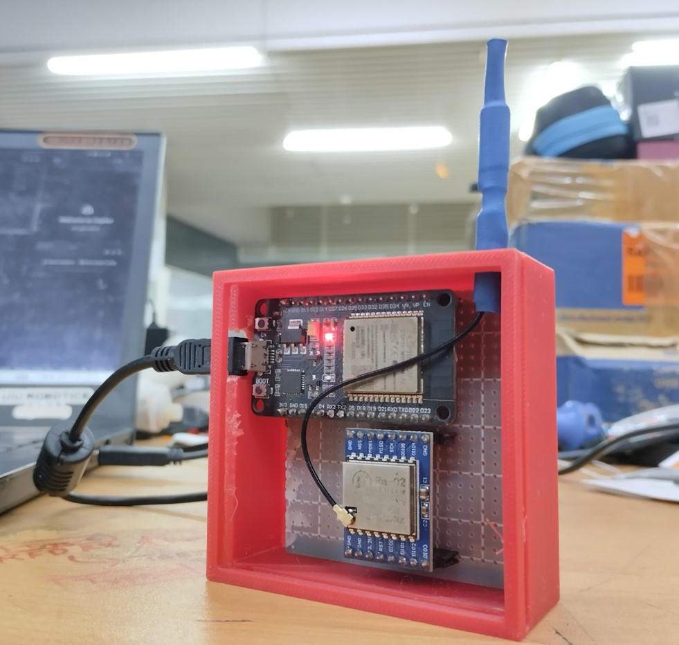

# 📡 LoRa Gateway with LED Indicator (ESP32/ESP8266 + SX1278)

This Arduino sketch sets up a **LoRa Gateway** using an ESP32 (or ESP8266) and an **SX1278 LoRa module**.  
The device receives LoRa messages and forwards them to the Serial Monitor (USB). It also **flashes an LED on GPIO 2** whenever a **message is received or sent**, using a **non-blocking timer** (no `delay()` used).


---

## ✨ Features

- ✅ Receives LoRa messages on 433MHz
- ✅ Sends test messages every 10 seconds
- ✅ Serial output in `rssi:'message'` format
- ✅ LED flashes on GPIO 2 when sending or receiving messages
- ✅ Non-blocking `millis()`-based LED timing

---

## 🔧 Hardware Required

- ESP32 or ESP8266
- LoRa module (e.g., SX1278)
- LED + 220Ω resistor
- Jumper wires and breadboard

---

## ⚡ Wiring Diagram

| SX1278 Pin | ESP32 Pin (example) | ESP8266 Pin (example) |
|------------|---------------------|------------------------|
| VCC        | 3.3V                | 3.3V                   |
| GND        | GND                 | GND                    |
| SCK        | GPIO 18             | D5                     |
| MISO       | GPIO 19             | D6                     |
| MOSI       | GPIO 23             | D7                     |
| NSS (CS)   | GPIO 5              | D8                     |
| RESET      | GPIO 14             | GPIO 14                |
| DIO0       | GPIO 2              | GPIO 2 or D4           |

📌 **GPIO 2** is also used for the **LED**, so avoid conflicts. You can move the LED pin if needed.

---

## 🧠 Behavior

- When a LoRa packet is **received**, the LED on GPIO 2 turns on for 200ms.
- When a message is **sent**, the LED also flashes for 200ms.
- LoRa messages are printed to Serial in this format: **rssi:'-85':'Hello World'**

---

## 🛠️ Installation

1. Install [Arduino IDE](https://www.arduino.cc/en/software)
2. Install the **LoRa library** by Sandeep Mistry:
 - Go to `Sketch` → `Include Library` → `Manage Libraries`
 - Search for **LoRa**, and install it
3. Connect your hardware as per the wiring diagram
4. Open the sketch and upload to your ESP32 or ESP8266

---

## 🧪 Example Serial Output

```
LoRa Gateway Initializing...
LoRa init success.
rssi:'-86':'Node 1: Moisture OK'
rssi:'-87':'Node 2: Low Battery'
Sent: Hello from gateway

```

---

## 🧼 Customization

- Change LoRa frequency in `LoRa.begin(433E6)` if needed (e.g., `868E6`, `915E6`)
- Modify send interval or disable it:

  ```cpp
  const unsigned long sendInterval = 10000; // Change or remove
  ```
- Change The LED Pin
  ```cpp
  #define LED_PIN 2 // Use another GPIO if needed
  ```
---

